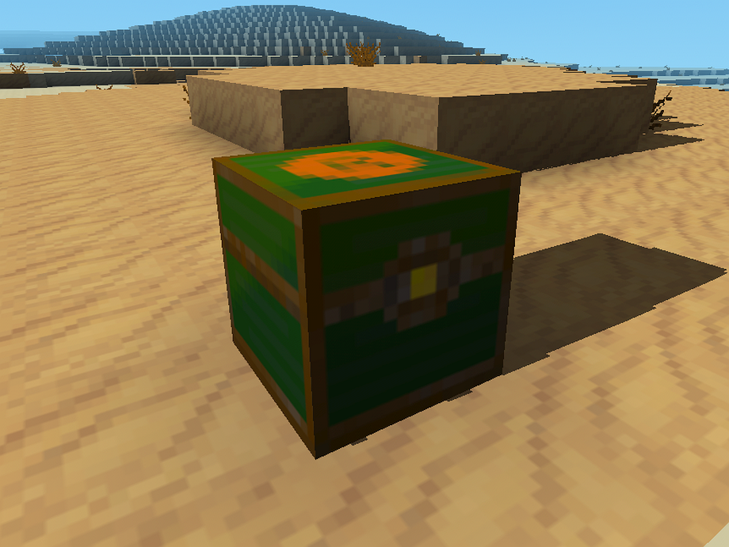

RESPAWN KIT - a Luanti/Minetest Mod

-- provides a craftable chest, that can be filled with a players personal respawn kit.

-- whatever the player puts in the chest, will be duplicated and put into the players main-inventory when he respawns after dying.

-- use either a Blacklist(default) or a Whitelist to control what can be put in the chest. Both lists will be created in the worldpath on first startup of the world:

BlackList = worldpath/respawn_kit_blacklist.txt

WhiteList = worldpath/respawn_kit_whitelist.txt 

Both lists must contain the item-names of the black/white-listed items, one name per line.

BlackList comes preconfigured with all mt-default ores.

WhiteList comes preconfigured with 2 example items.

-----

-----

default recipe for the "respawn_kit:respawn_chest"

'default:steelblock',  'default:mese',          'default:steelblock'

'default:steelblock',  'default:chest',         'default:steelblock'

'default:steelblock',  'default:diamondblock',  'default:steelblock'

----- 

**Intent**:

This mod is meant as an tool to change the balance of a server towards more Rogue-like experience.
It's trying to encourage pvp and enganging in dangerous activities without totally negating the need for resource gathering.
 
I suggest to:

turn-off keep-inventory & keep-armor,
disable the protection-time of the bone-block,
don't give cepter of return/resurection_wand on death(make it craftable instead) & 
don't give any other "respawn-kits".

-----
**License**: Code: MIT , Textures: CC0

**Mod dependencies**: default

**Credits**: 

based on parts of :

https://github.com/minefaco/death_cetro by 1faco &

https://github.com/MeseCraft/void_chest by MeseCraft

**Author**: DeadLock